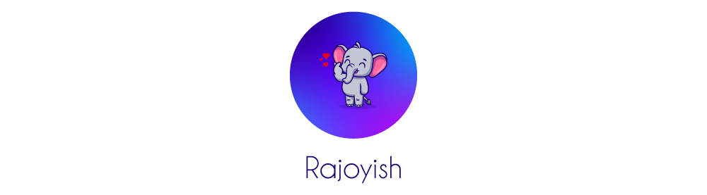

A light color theme hand-crafted for PHP/Laravel artisans!

> The theme optimized to meet the WCAG's 4.5:1 contrast ratio guidelines, allowing you to **code comfortably for hours, day or night**. Its high contrast ratio makes foreground and background colors easy to distinguish, enhancing readability and improving your coding experience.

##### 🐘 PHP/Laravel

##### 🐇 JS

##### 🕷 HTML

##### 🐬 CSS

**Enjoy!**
